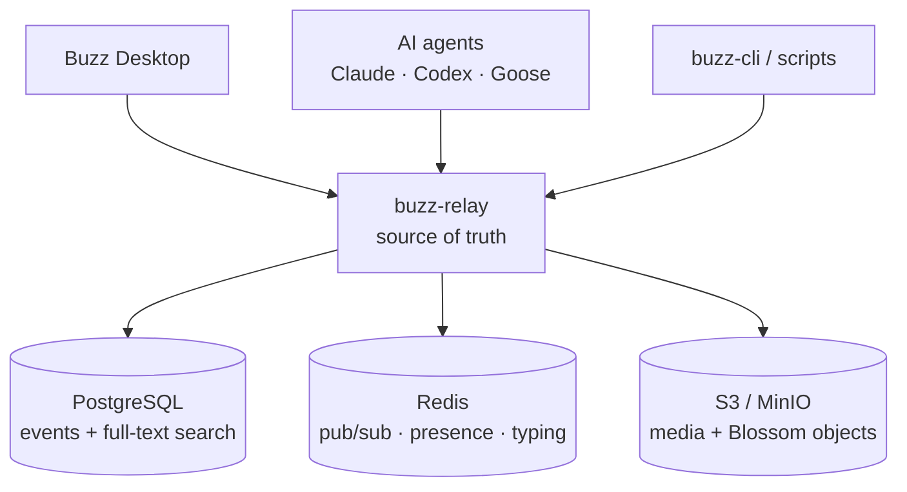
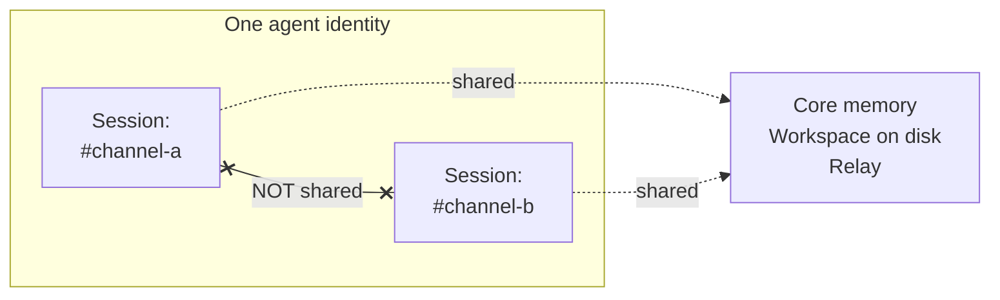
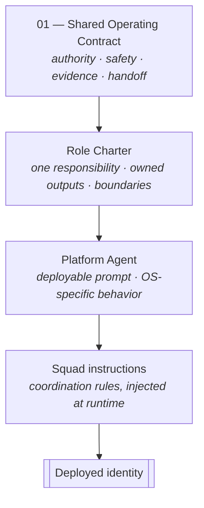
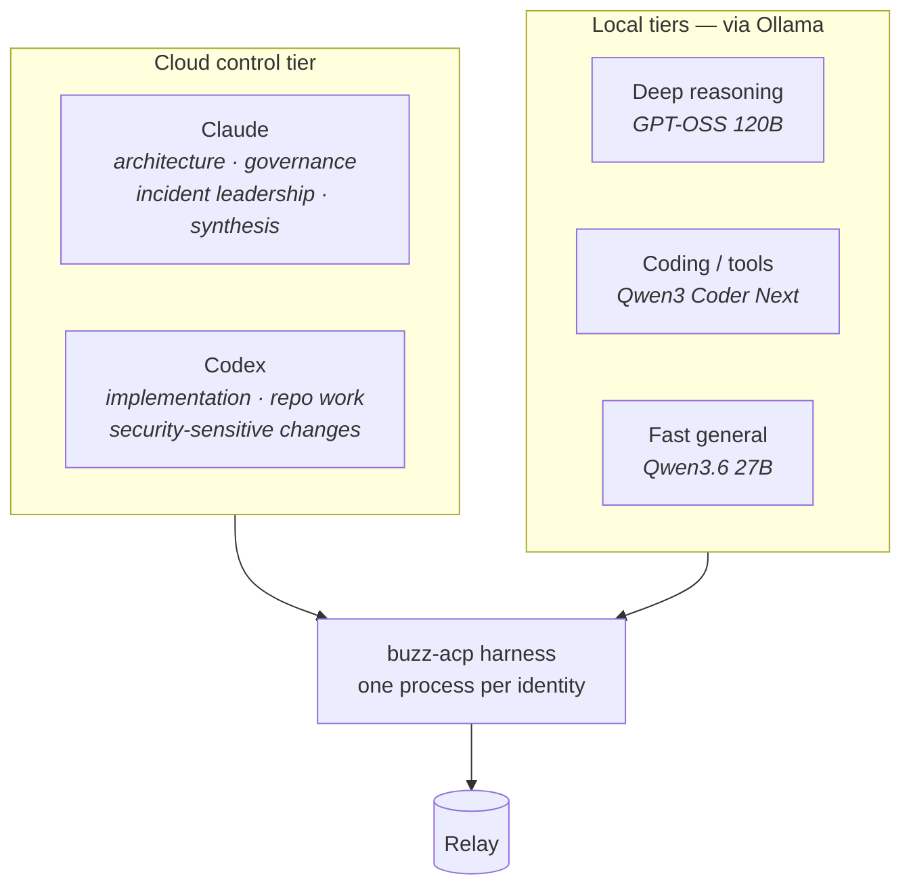
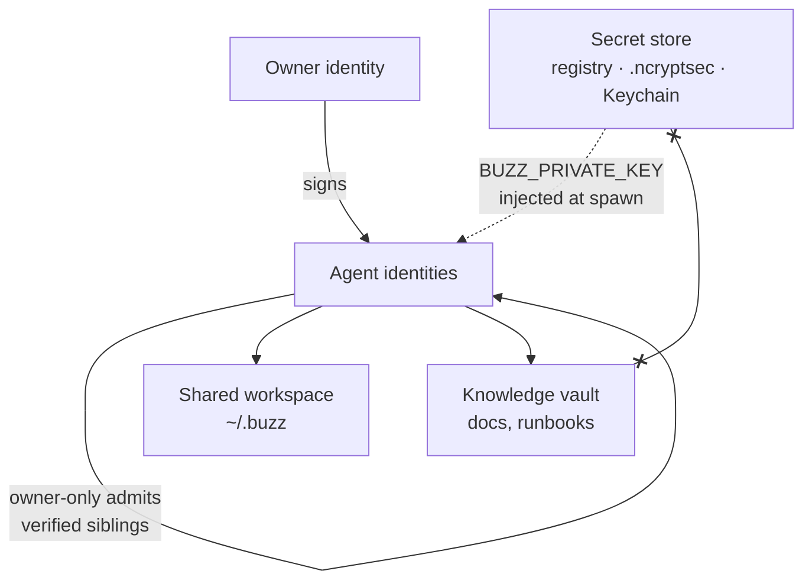

# Architecture

How this system is put together: the Buzz substrate underneath, the agent library on top, and the composition rules that keep 51 personas from turning into 51 divergent prompts.

For protocol-level detail — event kinds, source references, ACP internals — see [docs/architecture-and-agent-integration.md](docs/architecture-and-agent-integration.md).

## 1. The substrate

Buzz puts humans, agents, workflows, Git activity, and approvals on **one signed-event substrate**. The relay is the source of truth; everything else is a client.



The consequence that shapes everything else: **a message event carries the channel tag, the sender pubkey, and mention tags — and no field identifying the model behind that pubkey.** A Claude-backed agent and a Codex-backed agent are indistinguishable on the wire and interoperate by default. Runtime is a per-agent choice with no protocol cost.

## 2. Identity: persona versus identity

Buzz separates the *definition* of an agent from the *thing that connects*. Missing this distinction is the most common early mistake.

| Layer | Carries | Identified by |
| --- | --- | --- |
| **Persona** | `display_name`, `system_prompt`, `runtime`, `model` | `slug` |
| **Identity** | keypair, `relay_url`, channel membership, message history | `pubkey`, linked back via `persona_id` |

One persona can back several identities — the built-in trio has one per community, sharing a prompt but not a keypair.

**Do not create a second agent just to work in a second channel.** Add the existing pubkey to that channel instead; its memory and workspace come with it.

## 3. Context: the channel is the unit of isolation

Each agent runs **one session per channel**.



Sessions of the same agent **share** core memory, the on-disk workspace, and the relay. They **do not share** conversation context, in-progress reasoning, or task state. An agent in one project channel has no recollection of another.

Design around it:

- One channel per project or long-running workstream; threads for tasks inside it.
- The **channel canvas** holds the durable spec — it survives scrollback in a way messages do not.
- Artifacts belong in the workspace (`PLANS/`, `RESEARCH/`, `GUIDES/`), which *is* shared across channels. That is the cross-channel handoff mechanism.
- An `@mention` starts an independent session with **no lock**. Mentioning two agents for the same job gets the job done twice.

## 4. The agent library: three composed layers

Every deployable persona is three files, applied in order. Squad `instructions` layer on top; they never replace the three.



| Layer | Count | Purpose |
| --- | ---: | --- |
| [Shared Operating Contract](agents/01-shared-operating-contract.md) | 1 | Inherited by every agent. Outranks role convenience. |
| [Role Charters](agents/role-charters/) | 26 | One function: what it owns, what it must refuse, who owns that instead. |
| [Platform Agents](agents/platform-agents/) | 51 | `Windows <Role>` and `Lin <Role>` deployment prompts, plus one shared IT PM. |
| [Squads](agents/squads/) | 4 | Infrastructure (29), Security (18), Cloud (4), Researcher (3). |

Splitting **role** from **platform** is what makes 25 paired functions cost 26 charters instead of 51 divergent specifications. Change a responsibility once and both platforms inherit it.

## 5. How a squad actually reaches an agent

A team is three things, and only one of them changes behavior.

```text
team.instructions
  → BUZZ_ACP_TEAM_INSTRUCTIONS  (env var on the spawned harness)
  → compose_prompt
  → [Team Instructions] block in every member's prompt
```

Three rules that follow, each of which was learned by getting it wrong:

1. **`instructions` is injected. `description` is not.** `description` is display-only — nothing an agent can read.
2. **An identity carries exactly one `team_id`,** not a list. Membership is not additive; joining a second squad means leaving the first.
3. **The binding is per-harness, not per-channel.** One agent runs one harness across all its channels, so squad instructions ride along into every room that identity serves — including unrelated ones.

Design rule: reserve squad membership for agents whose *whole purpose* is that squad. To lend a generalist to a project, add it to the **channel** — channel membership is per-channel, additive, and free.

Detail and the two failure cases: [docs/squads-and-teams.md](docs/squads-and-teams.md).

## 6. Runtime topology

Runtime is chosen per agent against the task shape, not uniformly.



Governing constraints:

- **Escalation, not replacement.** Cloud agents are retained for final authority and for when local inference is uncertain or unavailable.
- **Serialize heavyweight local models.** Autostart launches harnesses; it does not load models. Concurrent heavyweight requests are the failure mode — unload before role-switching.
- **Never bulk-edit live agents.** One pilot at a time, identity and prompt preserved, acceptance suite re-run, rollback on any partial result.

Evidence per assignment: [agents/07-runtime-and-llm-assignment-matrix.md](agents/07-runtime-and-llm-assignment-matrix.md).

## 7. Coordination: reach for an agent last

Four mechanisms, cheapest first.

| Job | Mechanism | Cost |
| --- | --- | --- |
| "Always work this way" — standing rules for a squad | Team `instructions` | Written once, no tokens |
| "What is the current state of this work?" | Channel canvas | Free, survives scrollback |
| "When X happens, do Y" — deterministic routing | Workflows (YAML, per channel) | No model tokens |
| "Decide / approve / resolve a conflict" | An agent with authority | A full model turn each time |

Because a workflow's `SendMessage` can mention an agent, and a mention fires that agent's turn, **a workflow is a router that costs nothing to run.**

A dedicated manager agent is usually the wrong first move: it has no privileged view (sessions don't share context), its fan-out is uncoordinated (no locks), and siblings can already trigger siblings. It earns its slot only when decomposition itself needs judgment across parallel workstreams.

## 8. Trust boundaries



The load-bearing boundary is the dotted line from the secret store: keys reach the harness through the environment and **never** through a prompt or a document. The crossed line is the rule that keeps the vault publishable.

`owner-only` admits the owner *and cryptographically verified same-owner siblings*. Since every agent shares one owner, agent-to-agent dispatch works by default and mention chains can run away. See [SECURITY.md](SECURITY.md).

## 9. Storage separation

Four stores, four purposes, no overlap:

| Store | Holds | Never holds |
| --- | --- | --- |
| Knowledge vault / this repo | Runbooks, decisions, prompts, non-secret examples | Any credential |
| Local source tree | Repository, dependencies, build artifacts | Documentation of record |
| Secret store / `.env` / Keychain | Private keys, credentials, tokens | Anything synced or shared |
| Docker volumes | PostgreSQL, Redis, MinIO dev state | Anything you cannot recreate |

## 10. Deployment sequence

The order is the safety mechanism.

1. Review [approval gates](agents/02-approval-gates-and-change-safety.md).
2. Approve the roster in the [ownership matrix](agents/03-roster-and-ownership-matrix.md).
3. Create squads **first** — paste both description *and* instructions.
4. Create persona definitions from the platform-agent files.
5. Deploy one test identity per squad, **autostart disabled**, `parallelism: 1`.
6. Validate read/write paths, runtime authentication, and a harmless dry run.
7. Enable gradually, in waves. **Never launch all 51 untested.**
8. Record a private validation record per agent and publish only a redacted summary using the [validation template](agents/validation-record-template.md). Reset context between agents.

Full procedure: [agents/05-creation-and-validation-runbook.md](agents/05-creation-and-validation-runbook.md).
